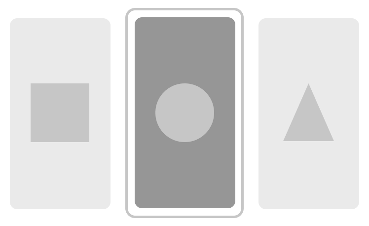

# artloop

<a href='http://www.recurse.com' title='Made with love at the Recurse Center'></a> <a href='http://newschool.edu' title='Made with love at The New School'></a> <a href="https://travis-ci.org/zachkrall/artloop" title="Travis CI Build"></a>

Currently maintained by [Zach Krall](https://github.com/zachkrall) and
[Sean Scalan](https://github.com/skiprox). (MFA Design + Technology,
Parsons School of Design)



## about

artloop is a script written in [Rust](https://rust-lang.org) that
cycles through all generative art `.app` files in a folder on a timed
interval.

artloop currently only works on macOS. Once all `.app` files are
collected from a folder, it executes the binary found in
`{APPNAME}.app/Contents/MacOS/`.

## setting up

to copy the most recent art-loop binary to your computer, run the
following code in your terminal
```shell
/bin/bash -c “$(curl -fsSL https://raw.githubusercontent.com/zachkrall/art-loop/master/bin/install)”
```

once installed, you'll be able to start artloop in your terminal. artloop
expects a command to include a relative path to a folder (defaults to
current folder you are in) and a number for how many minutes each
artwork should be viewed for.

```
artloop <FOLDER> --time <MINUTES>
```

artloop will run ... forever ... until the script is canceled by
entering ctrl-c (^C)


## experience

✨hopefully✨ you'll be able to find artloop on D12 at Parsons School
of Design.

## participate

### how to submit artwork

[ TO DO ]

### how to create compatible artwork

Download templates at [github.com/zachkrall/art-loop-templates](https://github.com/zachkrall/art-loop-templates)
